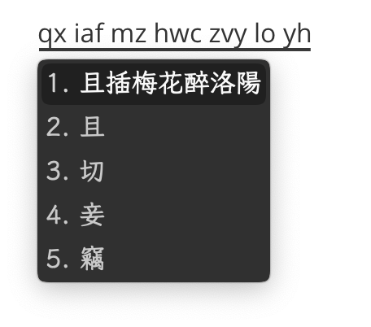

<h1 align="center">魔虎 Rime 输入方案</h1>

<p align="center">
<a href="https://github.com/rimeinn/rime-mohu/issues"></a>
<a href="https://zrmfans.cn/demo/"></a>
</p>

授权协议：完整的方案发行依 [GPL v3](https://www.gnu.org/licenses/gpl-3.0.en.html) 协议发布。若某文件中另有说明，则该文件可依对应许可协议再发行。

---

本项目采用双拼音码和虎码最长官方主码前两码，提供自然码与小鹤两组方案。每组包含智能、字词、整句和辅助码四种输入模式；默认菜单先列自然码组，再列小鹤组，最后列纯虎码单字方案。

方案只输出简体，不提供英文或日语混输，也不提供通、台、港、日、寜等字形切换。`ascii_mode` 仍可用于西文直输。字符范围开关显示为「常用字/全字集」；常用字范围与虎码 `core2022` 保持一致，当前为 9767 字。

8105 个常用字的固顶简码采用本仓库 NAS 研究结果；其余字符使用所选双拼加虎码前两码全码。虎码只取所有等长最长官方主码，不使用虎码自身简码，也不补齐一码字根。双拼方案只保留 `ohm` 虎码反查；纯虎码方案使用反引号引导无声调全拼反查。

> [!TIP]
> 如果您对其他音码或其他辅助码感兴趣，可参阅 [魔龙（rime-molong）](https://github.com/rimeinn/rime-molong) 项目。

魔虎是开放的、[社区维护](https://zrmfans.cn/book/misc/acknowledgement.html)的项目。它的样貌由每一位输入者定义，欢迎提交 PR 或 Issue。

- [了解更多](https://zrmfans.cn)

| 简快码                              | 整句辅助模式                             |
|-------------------------------------|------------------------------------------|
|  |  |

**辅助码筛选模式**

https://github.com/user-attachments/assets/ca8a8c1f-d076-47de-94b0-4e935a99a516

## 符号与反斜杠命令

简快符号与虎码保持一致，例如 `;w` 输入「？」、`;d` 输入「、」、`;v` 输入「《」。`/` 现在直接输入顿号「、」，符号菜单统一改用反斜杠引导，例如 `\bd`（标点）、`\bq`（表情）、`\fh`（符号）、`\jt`（箭头）和 `\sx`（数学符号）。只输入 `\` 会显示常用命令提示。

日期时间命令包括 `\date`、`\time`、`\week`、`\cdate` 和 `\fjq`，也可使用首字母入口 `\rq`、`\sj`、`\xq`、`\nl`、`\jq`。日期、时间、象棋、节气符号分别使用 `\rqfh`、`\sjfh`、`\xqfh`、`\jqfh`。原有的 `odate`、`otime`、`oweek`、`ocdate`、`ojq` 等输入方式继续保留。候选管理入口为 `\gl`；皮肤编辑器可用 `\skin`、`\pifu` 或 `\pfbj` 打开。表情与符号联想词库合并了魔虎和虎码的数据，保留双方独有的触发词与候选。

辅助码后缀也随符号入口迁移：使用 `编码\` 查询，使用 `编码\\` 后按空格进入自由加词。已有自定义补丁若覆盖了 `mohu/candidate_manager/prefix`、`mohu/pin/infix`、`recognizer/patterns/punct` 或 `recognizer/patterns/panacea`，需要同步把旧的 `==`、`/`、`//` 写法改为反斜杠写法。

# 方案维护

master 分支可使用如下命令进行日常维护：

```bash
make quick                           # 快速更新单字信息
make dict                            # 更新词库中的辅助码
make dist                            # 产生纯净方案到 ./dist 目录下
make dist DESTDIR=~/Library/Rime     # 将方案拷贝到 DESTDIR
make test                            # 执行单元测试
./make_simp_dist.sh                  # 产生简体版方案到 ./dist 目录下
```

注意：master 分支必须首先 `make quick` 后才能部署。

## 从魔然迁移

这次方案 ID 改名不保留兼容入口。先退出输入法，再预览迁移：

```bash
uv run tools/migrate_moran_to_mohu.py ~/Library/Rime
```

确认操作清单后执行：

```bash
uv run tools/migrate_moran_to_mohu.py ~/Library/Rime --apply
```

脚本会在用户目录中创建 `mohu-migration-backup-时间戳` 备份，把旧配置和学习数据迁入自然码组；小鹤组从空用户数据开始。遇到未知旧引用时脚本会在写入前停止。完成后重新部署 Rime。
