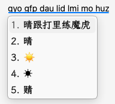

<h1 align="center">魔虎 Rime 输入方案</h1>
<h3 align="center">虎码用户想打舒适区</h3>


授权协议：完整的方案发行依 [GPL v3](https://www.gnu.org/licenses/gpl-3.0.en.html) 协议发布。若某文件中另有说明，则该文件可依对应许可协议再发行。

---

本项目基于魔然的优秀音形基座和虎码字根的高离散性，规则相对清晰，学习成本相对集中，堪称虎码用户的终极退路

方案用双拼+虎码字根前两码，提供自然码与小鹤两组方案。自然码组只保留智能整句模式；小鹤组包含智能、字词、整句和辅助码四种输入模式

```
推荐下载晴跟打Pro，全免费，包含双拼和虎码字根练习，以及后续的练单发文练习
```

双拼方案只保留虎码反查，由 `ohm` 或反引号 `` ` `` 引导，提示为〔虎〕；纯虎码方案使用反引号引导无声调全拼反查。


| 简快码                              | 整句辅助模式                   | 快捷加词                    |
|-------------------------------------|--------------------------|-------------------------|
|  |  |  |


## 符号与斜杠命令

简快符号与虎码保持一致，例如 `;w` 输入「？」、`;d` 输入「、」、`;v` 输入「《」。符号菜单使用斜杠引导，例如 `/bd`（标点）、`/bq`（表情）、`/fh`（符号）、`/jt`（箭头）和 `/sx`（数学符号）。只输入 `/` 会显示常用命令提示。

日期时间命令包括 `/date`、`/time`、`/week`、`/cdate` 和 `/fjq`，也可使用首字母入口 `/rq`、`/sj`、`/xq`、`/nl`、`/jq`。日期、时间、象棋、节气符号分别使用 `/rqfh`、`/sjfh`、`/xqfh`、`/jqfh`。原有的 `odate`、`otime`、`oweek`、`ocdate`、`ojq` 等输入方式继续保留。皮肤编辑器可用 `/skin`、`/pifu` 或 `/pfbj` 打开。表情与符号联想词库合并了魔虎和虎码的数据，保留双方独有的触发词与候选。

辅助码后缀使用 `编码/` 查询，使用 `编码//` 后按空格进入自由加词。

## 魔虎大模型方案

魔虎大模型方案是独立 addon。自然码用户下载 `mohu-llm-zrm-latest.zip`，小鹤用户下载 `mohu-llm-flypy-latest.zip`。包内 `data/sentence-ngram-mobile.bin` 为魔虎自定义候选模型 v5（SHA-256 `c2c148ea`），负责整句候选生成与排序；训练语料含 LCCC（CC-BY-NC-SA）与 TNews/THUCNews（研究用途），仅限个人使用，请勿再分发。

### 安装自然码包

1. 从 GitHub Release 下载 `mohu-llm-zrm-latest.zip`。
2. 解压后双击 `install_mohu_llm_zrm.command`。
3. 安装器会把自然码方案和共享运行时复制到 `~/Library/Rime/`，只注册 `mohu_llm_zrm`，不会注册小鹤方案。
4. 在 Squirrel 菜单中执行“重新部署”，然后切换到“魔虎大模型·自然码”。

安装器会保留已有的 Rime 用户词库和用户配置；重复执行是幂等的。

### 切换神经重排模型

Qwen 是可选的神经重排，权重不随方案包分发。安装 Qwen3 0.6B 4-bit 后，将模型目录放到：

```text
~/Library/Rime/mohu_llm/models/Qwen3-0.6B-4bit
```

然后在输入法中输入 `/model`，选择 `Qwen3-0.6B-4bit`；或在已安装的 runtime 目录执行：

```bash
~/Library/Rime/mohu_llm/runtime/switch_qwen_model.command qwen3-0.6b
```

切换后重新部署 Squirrel。未安装 Qwen 时，整句输入直接使用包内的 v5 模型。

如果需要使用 Qwen3.5 0.8B，则下载对应 manifest 指定的目录并选择 `qwen35-0.8b`；本项目不会自动在 Qwen3.0 和 Qwen3.5 之间切换。

# 方案维护

master 分支可使用如下命令进行日常维护：

```bash
make quick                           # 快速更新单字信息
make dict                            # 更新词库中的辅助码
make dist                            # 产生纯净方案到 ./dist 目录下
make dist DESTDIR=~/Library/Rime     # 将方案拷贝到 DESTDIR
make test                            # 执行单元测试
./make_simp_dist.sh                  # 产生简体版方案到 ./dist 目录下
```

注意：master 分支必须首先 `make quick` 后才能部署。

### 万象 nightly

万象词库每日自动同步。同步检查通过并合并到 `main` 后，GitHub Actions 会更新 [nightly 滚动 Release](https://github.com/fcxxxz/rime-mohu/releases/tag/nightly)，其中提供：

- [自然码 nightly](https://github.com/fcxxxz/rime-mohu/releases/download/nightly/rime-mohu-zrm-nightly.zip)
- [小鹤 nightly](https://github.com/fcxxxz/rime-mohu/releases/download/nightly/rime-mohu-flypy-nightly.zip)

这是预发布版本，固定使用 `nightly` 标签和资产名。Release 说明会记录万象上游 revision、主分支合并提交、增删统计和 CC BY 4.0 署名信息；如果某次发布失败，下一次定时运行会检查 revision 或资产是否缺失并自动补发。

## 从魔然迁移

这次方案 ID 改名不保留兼容入口。先退出输入法，再预览迁移：

```bash
uv run tools/migrate_moran_to_mohu.py ~/Library/Rime
```

确认操作清单后执行：

```bash
uv run tools/migrate_moran_to_mohu.py ~/Library/Rime --apply
```

脚本会在用户目录中创建 `mohu-migration-backup-时间戳` 备份，把旧配置和学习数据迁入自然码组；小鹤组从空用户数据开始。遇到未知旧引用时脚本会在写入前停止。完成后重新部署 Rime。
