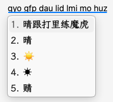

<h1 align="center">魔虎 Rime 输入方案</h1>
<h3 align="center">虎码用户想打舒适区</h3>


授权协议：完整的方案发行依 [GPL v3](https://www.gnu.org/licenses/gpl-3.0.en.html) 协议发布。若某文件中另有说明，则该文件可依对应许可协议再发行。

---

本项目基于魔然的优秀音形基座和虎码字根的高离散性，规则相对清晰，学习成本相对集中，堪称虎码用户的终极退路

方案用双拼+虎码字根前两码，提供自然码与小鹤两组方案。两个发布包均只提供一个主方案，整句、辅助码和简快码能力已合并到主方案中。

```
推荐下载晴跟打Pro，全免费，包含双拼和虎码字根练习，以及后续的练单发文练习
```

双拼方案只保留虎码反查，由 `ohm` 或反引号 `` ` `` 引导，提示为〔虎〕；纯虎码方案使用反引号引导无声调全拼反查。


| 简快码                              | 整句辅助模式                   | 快捷加词                    |
|-------------------------------------|--------------------------|-------------------------|
|  |  |  |


## 符号与斜杠命令

简快符号与虎码保持一致，例如 `;w` 输入「？」、`;d` 输入「、」、`;v` 输入「《」。符号菜单使用斜杠引导，例如 `/bd`（标点）、`/bq`（表情）、`/fh`（符号）、`/jt`（箭头）和 `/sx`（数学符号）。只输入 `/` 会显示常用命令提示。

日期时间命令包括 `/date`、`/time`、`/week`、`/cdate` 和 `/fjq`，也可使用首字母入口 `/rq`、`/sj`、`/xq`、`/nl`、`/jq`。日期、时间、象棋、节气符号分别使用 `/rqfh`、`/sjfh`、`/xqfh`、`/jqfh`。原有的 `odate`、`otime`、`oweek`、`ocdate`、`ojq` 等输入方式继续保留。表情与符号联想词库合并了魔虎和虎码的数据，保留双方独有的触发词与候选。

辅助码后缀使用 `编码/` 查询，使用 `编码//` 后按空格进入自由加词。

## 魔虎方案

自然码用户下载 `rime-mohu-zrm-latest.zip`，小鹤用户下载 `rime-mohu-flypy-latest.zip`。解压包内文件到 Rime 用户目录后执行一次“重新部署”。两个包分别只启用对应方案，包内不含语言模型。

完整安装步骤、模型放置、macOS 专用的 `解除隔离.command`、Rime 同步助手和常见问题统一见 [安装说明](安装说明.md)。

V5 的跨候选上下文重排由运行时引擎、Lua filter/桥接和 schema 配置共同启用，不需要替换模型文件。使用同一模型的既有安装如需此能力，必须同步更新这些运行时文件。2026-09-03 的隔离五方案基准以 1,000 个二字目标词、每词 20 个训练集精确去重的真实前缀测量：魔虎在一位末辅上的上下文修好率为自然码 66.67%、小鹤 66.91%，完整口径与排名见 [报告](docs/reports/2026-09-03-tail-auxiliary-context-benchmark.md)。

更新运行时文件或从旧版 `mohu_llm_*` 迁移后，除“重新部署”外还必须完全退出并重启 Squirrel；动态库按宿主进程生命周期加载，旧进程可能继续使用已移入废纸篓的旧 `libtigerengine.dylib`。若模型文件存在但首选仍是 smart 候选，请先查看日志中的 `mohu_tiger_sentence` 错误，并用 `lsof -p $(pgrep -x Squirrel)` 核对实际加载路径。

如果 native 已加载但结果仍受个人历史影响，请检查 `mohu/config/user-ngram.snapshot`。默认 `tiger/user_model: true`、`user_model_weight: 0.85` 会把上屏记录与 V5 模型融合；清空或暂时关闭该用户层，才能观察纯 V5 模型排序。

### 放置 V5 模型

从 GitHub Release 下载 `mohu-sentence-ngram-v5.bin`，放到：

```text
~/Library/Rime/mohu/model/mohu-sentence-ngram-v5.bin
```

运行时固定读取 `mohu-sentence-ngram-v5.bin`；没有模型文件时会记录一次错误并回退到普通候选。模型资源由发布/部署步骤单独校验，不在输入热路径扫描目录。

# 文件入口：码表、词库与配置

第一次维护时，先看这张入口表：

| 你要改的内容 | 应修改的文件 | 是否自动生成 |
|---|---|---|
| 字、词的编码、简码、完整码、同码初始顺序 | `mohu_zrm.dict.yaml` | 否，主码表 |
| 小鹤版本的对应编码 | `mohu_flypy.dict.yaml` | 是，由自然码主表转换 |
| 单字读音、虎码辅码、字频等整句基础数据 | `tools/data/lexicon_sources/zrm/mohu_zrm.chars.dict.yaml` | 是，由 `mohu_zrm.dict.yaml` 等源生成 |
| 人工维护的整句词条 | `tools/data/lexicon_sources/zrm/mohu_zrm.words.dict.yaml` | 否，词库源 |
| 腾讯、万象、经典等外部词库 | `tools/data/lexicon_sources/zrm/` 对应来源文件 | 按来源脚本同步或生成 |
| 运行时整句词库 | `mohu_zrm.words.dict.yaml`、`mohu_flypy.words.dict.yaml` | 是，合并来源，不直接编辑 |
| 自然码/小鹤方案配置 | `mohu_zrm.schema.yaml`、`mohu_flypy.schema.yaml` | 两主方案直接维护；编译垫片派生 |
| 全局 Rime 配置 | `default.yaml` | 否 |
| 常用字/全字集过滤名单 | `mohu_charset.dict.yaml` | 来源于虎码数据；字后的 `t` 是分类标记 |
| 虎码反查与拼音反查 | `tiger.dict.yaml`、`mohu_pinyin.dict.yaml` | `mohu_pinyin.dict.yaml` 自动生成 |

最常见的两个入口是：**改编码去 `mohu_zrm.dict.yaml`，加人工整句词去 `tools/data/lexicon_sources/zrm/mohu_zrm.words.dict.yaml`**。改完后运行 `make check-code-table` 和 `make dict`；不要直接改 `mohu_*.words.dict.yaml`，因为下一次构建会重新生成它。

`tools/data/lexicon_sources/flypy/` 和根目录的 `mohu_flypy.words.dict.yaml` 都是小鹤派生/合并结果，通常不直接维护。发布包通过白名单选择运行文件，构建中间文件不会全部进入 Git。

# 日常打包：只记一个命令

在仓库根目录执行：

```bash
make pack
```

它会更新源数据的派生文件、编译引擎并生成两份桌面包：

- `rime-mohu-zrm.zip`：自然码。
- `rime-mohu-flypy.zip`：小鹤。

对应展开目录仍是 `dist-zrm/` 和 `dist-flypy/`。zip 内文件直接位于根目录，解压到 Rime 用户目录后重新部署；更新引擎时还需完全退出并重启鼠须管。包内不带模型，保留原有 `mohu/model/mohu-sentence-ngram-v5.bin`。

四码字词逐对覆盖改 `mohu/four_code_yield_pairs_zrm.txt`（自然码）或 `mohu/four_code_yield_pairs_flypy.txt`（小鹤）；每行是“词<Tab>让位的字”。单字有短码时，输入完整四码还会受 `mohu/ijrq/enable` 的“出简让全”规则影响：完整码保留，首选后移；不用从主码表删除完整码。

<details>
<summary>只更新数据、单独打包或运行测试时的其他命令</summary>

```bash
make dict                # 更新字词派生资源
make quick               # 更新单字、反查、拆分等资源
make dist-zrm            # 仅生成自然码目录
make dist-flypy          # 仅生成小鹤目录
make test                # 测试
make dist-mobile-zrm     # 手机自然码精简包
make dist-mobile-flypy   # 手机小鹤精简包
```

</details>

日常个人定制（个人拼写别名、加词入口对照、自定义短语、哪些设置会自动保存）见 [个人定制与组词规则](docs/dingzhi-个人定制与组词规则.md)。字词编码、简码与同码顺序直接维护在 `mohu_zrm.dict.yaml`，见 [字词码表维护](docs/code-table.md)。

### 万象 nightly

万象词库每日自动同步。同步检查通过并合并到 `main` 后，GitHub Actions 会更新 [nightly 滚动 Release](https://github.com/fcxxxz/rime-mohu/releases/tag/nightly)，其中提供：

- [自然码 nightly](https://github.com/fcxxxz/rime-mohu/releases/download/nightly/rime-mohu-zrm-nightly.zip)
- [小鹤 nightly](https://github.com/fcxxxz/rime-mohu/releases/download/nightly/rime-mohu-flypy-nightly.zip)

这是预发布版本，固定使用 `nightly` 标签和资产名。Release 说明会记录万象上游 revision、主分支合并提交、增删统计和 CC BY 4.0 署名信息；如果某次发布失败，下一次定时运行会检查 revision 或资产是否缺失并自动补发。

## 从魔然迁移

这次方案 ID 改名不保留兼容入口。先退出输入法，再预览迁移：

```bash
uv run tools/migrate_moran_to_mohu.py ~/Library/Rime
```

确认操作清单后执行：

```bash
uv run tools/migrate_moran_to_mohu.py ~/Library/Rime --apply
```

脚本会在用户目录中创建 `mohu-migration-backup-时间戳` 备份，把旧配置和学习数据迁入自然码组；小鹤组从空用户数据开始。遇到未知旧引用时脚本会在写入前停止。完成后重新部署 Rime。

发布包的方案字词数据已收敛为 `mohu_<scheme>.dict.yaml`（字词码表）与 `mohu_<scheme>.words.dict.yaml`（合并整句词库）。构建原料留在 `tools/data/lexicon_sources/`，不随包分发；反查和字集分类的三个辅助词典仍保留。详见 [字词码表维护](docs/code-table.md)。
